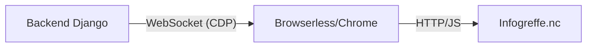

# Scraping Complexe sous Docker avec Browserless

Ce document explique l'architecture mise en place pour scraper des sites modernes (SPA, React, Angular) ou protégés (Cloudflare) comme **Infogreffe.nc** au sein d'un environnement Docker.

## L'Architecture

Le problème classique de Docker est qu'installer un navigateur (Chromium) dans l'image de votre application (Django) l'alourdit considérablement et pose des problèmes de dépendances système (libgbm, nss, etc.).

La solution choisie est le mode **Sidecar** :
1.  **Service `browserless`** : Un conteneur dédié qui fait tourner Chromium et expose une API via WebSocket.
2.  **Service `backend`** : Votre application Django qui utilise `playwright` pour piloter le navigateur distant.



## Configuration Docker Compose

Le service est défini comme suit dans `docker-compose.yml` :

```yaml
browserless:
  image: browserless/chrome:latest
  ports:
    - "3000:3000"
  environment:
    - MAX_CONCURRENT_SESSIONS=5
    - CONNECTION_TIMEOUT=60000
```

## Implémentation du Scraper (Python)

Le scraper n'utilise pas `browser.launch()` mais `connect_over_cdp()`.

```python
from playwright.sync_api import sync_playwright

def run_scraping():
    with sync_playwright() as p:
        # Connexion via le réseau interne Docker
        browser = p.chromium.connect_over_cdp("ws://browserless:3000")
        page = browser.new_page()
        
        # Navigation et interaction
        page.goto("https://www.infogreffe.nc/...", wait_until="networkidle")
        
        # Capture de données ou interception réseau
        # ...
        
        browser.close()
```

## Avantages de Browserless

1.  **Isolation** : Si le navigateur crash ou fuit de la mémoire, seul le conteneur `browserless` est affecté, pas votre API Django.
2.  **Performance** : `browserless` gère intelligemment le pool de sessions et le nettoyage des processus zombies.
3.  **Bypass Anti-Bot** : Browserless inclut des configurations de headers et de comportements qui imitent mieux un humain qu'un script `requests` classique.
4.  **Débogage** : Vous pouvez visualiser ce que fait le navigateur en allant sur `http://localhost:3000` (interface de debug de Browserless).

## Maintenance

Si le scraping échoue subitement :
1.  Vérifiez que le conteneur tourne : `docker compose ps browserless`.
2.  Redémarrez le service : `docker compose restart browserless`.
3.  Vérifiez les quotas de sessions si vous lancez beaucoup de consolidations en parallèle.
